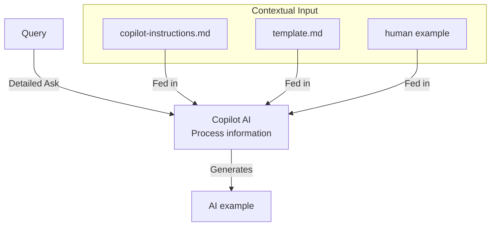

# AI Examples

This repository is a collection of real-life examples using AI. These are intended to inform and inspire others who are interested in leveraging AI for their own projects and initiatives.

## Included examples

- [New epiworld model](./human/new_epiworld_model.md) (human).
- [Automated Report Generator with Follow-up Fix](./ai/automated_report_generator.md) (AI).
- [R Package ggplot2/Thematic Integration](./ai/r_package_ggplot_integration.md) (AI).
- [Exposing C++ Function to R Interface](./ai/cpp_function_exposure_to_r.md) (AI).
- [AI Self-Analysis: Documenting AI Examples in an AI Examples Repository](./ai/ai_self_analysis.md) (AI).
- [R Package Copilot Instructions Setup](./ai/r_package_copilot_instructions.md) (AI).
- [R Package NEWS.md File Creation](./ai/r_package_news_file.md) (AI).
- [Book Translation: Applied Network Science with R to Spanish](./ai/book_translation_spanish.md) (AI).
- [When CI Fix Becomes Complete Overhaul: A Scope Creep Example](./ai/ci_scope_creep_failure.md) (AI).

## Workflow

Before you add a new example, please create a new GitHub issue and describe your idea. The examples should be added via Pull Requests.

1. Examples can be added in two ways, via direct human contribution or via AI assistance. For either case, you should use the template available [here](./template.md).

2. If you are a human adding an example, save it under the `./human/` directory. If you are an AI, save it under `./ai/`.

3. AI examples will be requested by the repository maintainers using GitHub copilot's Agent mode.

4. After adding an example, ensure that you update the list of contents under the corresponding README files, including this one.

## How the AI reports work

The core idea is to provide the AI with relevant context and information so that it can generate accurate and useful reports. This is achieved through a structured input process:

Most of it is specified in the [`copilot-instructions.md`](./.github/copilot-instructions.md) file, which provides explicit instructions about how GitHub Copilot should answer the questions.

## General recommendations for using AI

- Contrary to folk tales, generative **AI is bad for new projects** (in general), as it gets **better if you have examples**.
- Use the `copilot-instructions.md` document.
- Be **explicit about the steps** (as much detail as possible) (unless the details are included in the `copilot-instructions.md`!)
- Tell it what **should not** be done.
- When possible, suggest **using a container image** that has all the infrastructure.
- You can give contextual information via URLs!
- **Examples are important**: you can reference them.
- Ensure you have tests that the AI can see.

## AI disclosure

Obviously, this project makes use of AI. Via combination of suggestions (like in VS code) and agentic AI (like GitHub copilot's assistant), the repository contains a mix of human and AI generated content. Fully generated AI documents will be clearly labeled as such.
